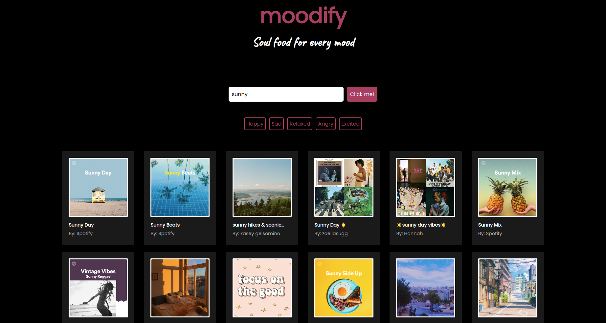

# moodify

moodify is a **web app build with React** which takes your current mood as an input and outputs a selection of Spotify playlists based on the input which are guaranteed to lift your spirits up and get you over that rainy day funk. :relaxed:

You can access the app using the [following link](https://moodify-webapp.herokuapp.com/).

### :thumbsup: Motivation behind the project
Accessing Spotify playlists from any device with as few steps as possible by building a simple and responsive interface while learning how to work with **React** and **Spotify API**.

### :seedling: What I learned
:arrow_right: how to obtain **Spotify app authorization** by using the **client credentials flow**  
:arrow_right: how to safely **store sensitive data** by using **enviroment variables**  
:arrow_right: how to access and display playlists data from the **Spotify Search API**  
:arrow_right: how to **dynamically change the Search API query** based on the user's input  
:arrow_right: how to achieve nice looking & responsive layout by unleashing **CSS Grid** powers  

